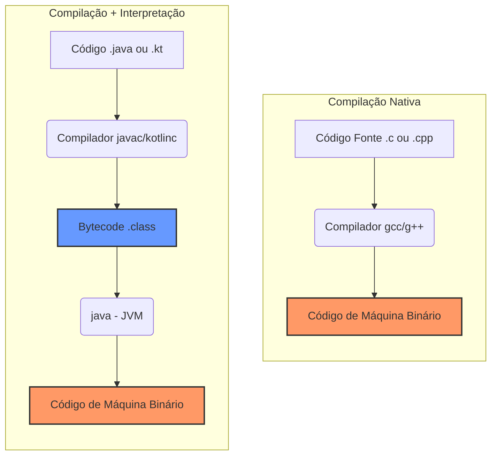

# JVM: Compilação e Geração de Código de Máquina

## Comparação com a Compilação Nativa

- Compilação Nativa: Exemplo de fluxo C/C++.
- Compilação + Interpretação com JIT: Exemplo de fluxo Java/Kotlin.

- Por omissão, a JVM interpreta Bytecode usando um processo de compilação _Just-in-time_ (JIT).
  - Este processo foi introduzido para melhor o desempenho da JVM.

## Linguagem Java

- Compilação: `javac MeuPrograma.ajva`
- Execução: `java MeuPrograma`
  - O comando `java` é a JVM.

## Linguagem Kotlin

- Compilação: `kotlinc MeuPrograma.kt`
- Execução: `kotlin MeuProgramaKt`
  - Equivalente a: `java -cp "caminho/para/kotlin-stdlib.jar:." MeuProgramaKt`
  - O comando `kotlin` é um _wrapper_ da JVM java.
